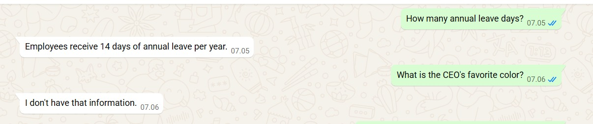

# WhatsApp AI Assistant

A production-oriented AI-powered WhatsApp chatbot built with **Python** and **FastAPI** that integrates **Google Gemini**, **Retrieval-Augmented Generation (RAG)**, and **ChromaDB** to answer questions from a custom knowledge base and process voice messages.

This project is designed as a portfolio project for transitioning from software engineering into AI engineering, with an architecture that emphasizes modularity, maintainability, and extensibility.

---

## Demo

### Voice Transcription


---

### Knowledge Base Q&A



---

## Features

- WhatsApp webhook integration
- AI-powered text responses using Google Gemini
- Voice message transcription
- Retrieval-Augmented Generation (RAG)
- Knowledge base indexing
- Semantic search with vector embeddings
- ChromaDB vector database
- Conversation history storage
- Modular provider architecture
- FastAPI REST backend
- Ready for Docker deployment

---

## Tech Stack

| Category | Technology |
|----------|------------|
| Language | Python 3 |
| Web Framework | FastAPI |
| AI Model | Google Gemini |
| Vector Database | ChromaDB |
| Embeddings | Gemini Embeddings |
| Database | SQLite |
| HTTP Client | Requests |
| Development Server | Uvicorn |
| Tunnel | Cloudflared |
| Version Control | Git |

---

## Getting Started

### 1. Clone the repository

```bash
git clone https://github.com/a-h-a-m/rag-whatsapp-assistant.git
cd rag-whatsapp-assistant
```

### 2. Create a virtual environment

```bash
python -m venv venv
```

Activate it:

**Windows**

```bash
venv\Scripts\activate
```

**Linux/macOS**

```bash
source venv/bin/activate
```

### 3. Install dependencies

```bash
pip install -r requirements.txt
```

### 4. Configure environment variables

Create a `.env` file based on `.env.example`.

### 5. Initialize the conversation database

```bash
python -m app.database.init_db
```

### 6. Build the knowledge index

```bash
python -m app.rag.indexer
```

### 7. Start the server

```bash
uvicorn app.main:app --reload
```

---

## Project Structure

```text
whatsapp-ai-bot/
│
├── app/
│   ├── core/
│   ├── providers/
│   │   └── gemini/
│   ├── rag/
│   ├── routes/
│   ├── services/
│   ├── tests/
│   └── main.py
│
├── knowledge/
│   ├── company.txt
│   └── ...
│
├── vector_db/
│
├── chat_history.db
│
├── requirements.txt
│
└── README.md
```

---

## System Architecture

```text
                    WhatsApp

                        │

                        ▼

               Green API Webhook

                        │

                        ▼

                   FastAPI Server

                        │

            ┌───────────┴───────────┐

            ▼                       ▼

      Voice Messages          Text Messages

            │                       │

            ▼                       ▼

     Audio Transcription      RAG Pipeline

            │                       │

            ▼                       ▼

        Gemini API           Embedding Search

                                      │

                                      ▼

                                 ChromaDB

                                      │

                                      ▼

                               Relevant Context

                                      │

                                      ▼

                              Prompt Construction

                                      │

                                      ▼

                                Gemini Response

                                      │

                                      ▼

                           WhatsApp Reply Message
```

---

## RAG Pipeline

```text
User Question

      │

      ▼

Generate Embedding

      │

      ▼

Search ChromaDB

      │

      ▼

Retrieve Relevant Documents

      │

      ▼

Construct Prompt

      │

      ▼

Gemini LLM

      │

      ▼

Final Answer
```

---

## Voice Transcription Flow

```text
Voice Message

      │

      ▼

Webhook

      │

      ▼

Download Audio

      │

      ▼

Gemini Transcription

      │

      ▼

Send Transcript
```

---

## Knowledge Base

Knowledge is stored as plain text files inside:

```text
knowledge/
```

Example:

```text
Company Information

Office hours:
Monday-Friday

Annual leave:
14 days

Remote work:
Allowed with manager approval
```

The indexing process:

```text
TXT Files

    │

    ▼

Chunking

    │

    ▼

Embedding Generation

    │

    ▼

Store in ChromaDB
```

---

## Build the Knowledge Index

After adding or modifying files in the `knowledge/` directory, rebuild the vector database:

```bash
python -m app.rag.indexer
```

This command:

- Reads all documents from `knowledge/`
- Splits them into chunks
- Generates embeddings using Gemini
- Stores the vectors in `vector_db/`

> **Note:** The `vector_db/` directory is generated automatically and is intentionally excluded from version control.

---

## Conversation Memory

Conversation history is stored in SQLite.

Each message contains:

- Chat ID
- Role (user / assistant)
- Message content
- Timestamp

This allows future implementation of conversational memory and AI agents.

---

## Current Capabilities

- Answer questions from a custom knowledge base
- Transcribe WhatsApp voice messages
- Store conversation history
- Retrieve relevant documents using semantic search
- Respond using Gemini grounded by retrieved context

---

## Future Improvements

- LangChain integration
- LangGraph AI agents
- Tool calling
- Function calling
- PostgreSQL support
- Redis caching
- Docker Compose
- Kubernetes deployment
- Authentication
- Admin dashboard
- Multi-user support
- OCR document ingestion
- PDF knowledge ingestion
- Streaming responses
- Conversation summarization
- Hybrid search (keyword + vector)
- Metadata filtering
- Automated evaluation

---

## Learning Objectives

This project demonstrates practical experience with:

- Python backend development
- FastAPI
- REST API integration
- Google Gemini API
- Prompt engineering
- Retrieval-Augmented Generation (RAG)
- Vector databases
- Embeddings
- Semantic search
- WhatsApp automation
- Modular software architecture
- AI application development

---

## Status

Current project status:

- ✅ WhatsApp Integration
- ✅ FastAPI Backend
- ✅ Voice Transcription
- ✅ Gemini Integration
- ✅ ChromaDB
- ✅ Embeddings
- ✅ RAG Pipeline
- ✅ Knowledge Base
- ✅ Conversation Memory
- 🚧 AI Agents
- 🚧 Tool Calling
- 🚧 LangGraph
- 🚧 Docker Deployment

---

## License

This project is intended for educational and portfolio purposes.