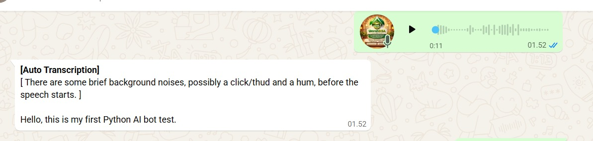
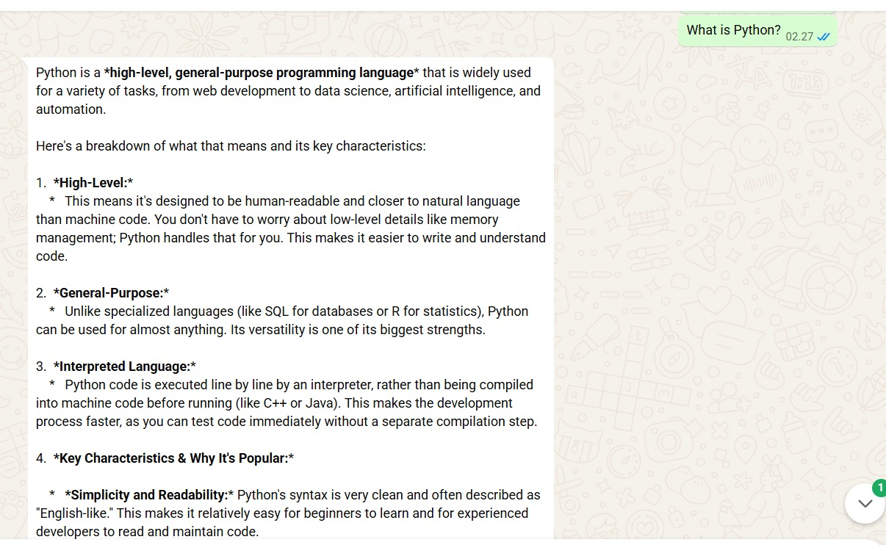
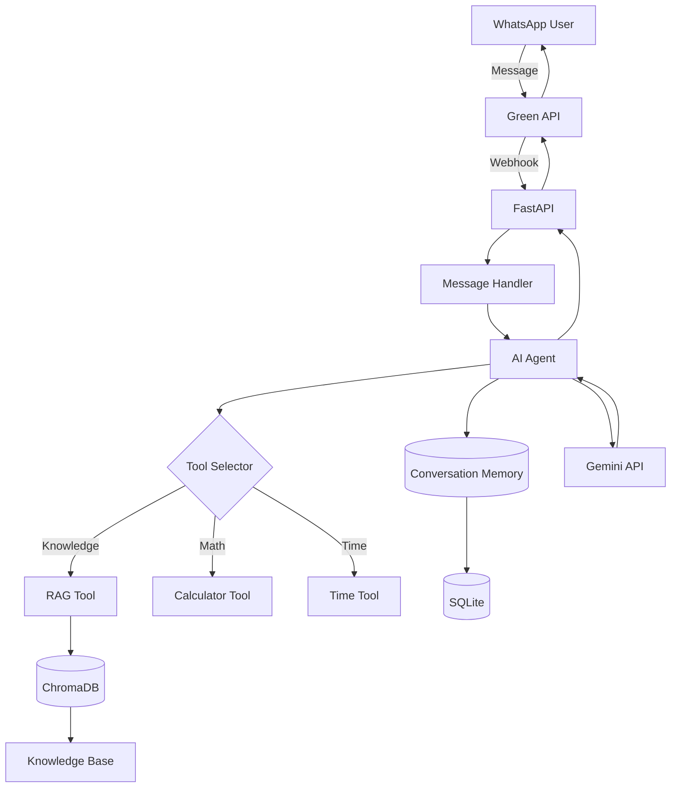
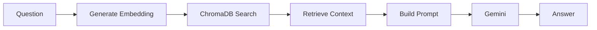
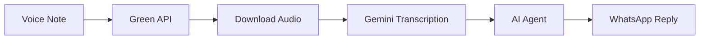
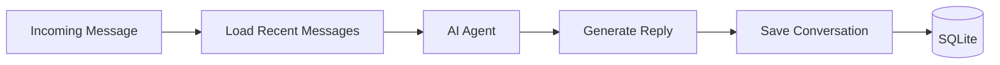
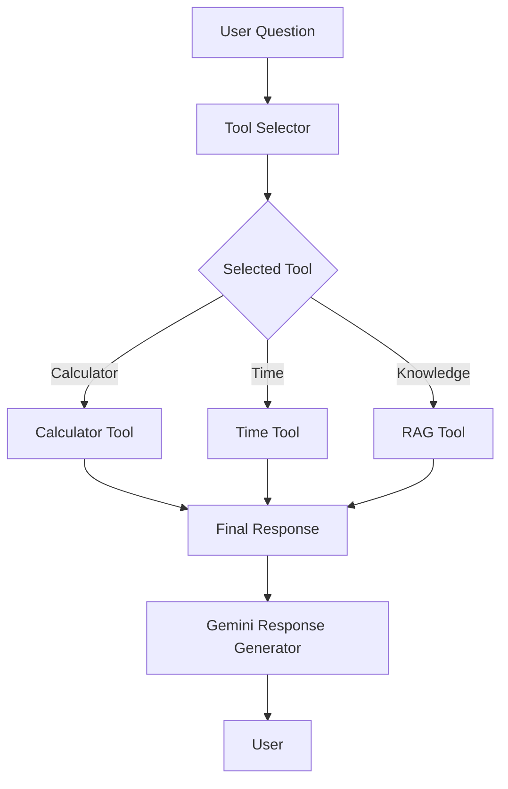
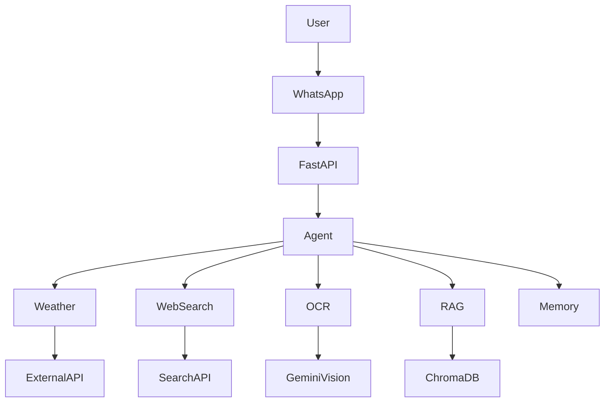

# 🤖 WhatsApp AI Assistant

An AI-powered WhatsApp assistant built with **Python**, **FastAPI**, **Gemini**, and **ChromaDB**.

The assistant supports voice transcription, Retrieval-Augmented Generation (RAG), conversation memory, and tool-based reasoning to answer user questions intelligently through WhatsApp.

---

## Project Overview

This project started as a migration from an existing PHP and Node.js WhatsApp bot into a modern Python architecture.

Rather than simply replying with predefined messages, the assistant combines Large Language Models (LLMs), Retrieval-Augmented Generation (RAG), conversation memory, and modular tools to provide context-aware responses.

The project is designed as a learning platform for backend AI engineering concepts including FastAPI, vector databases, embeddings, prompt engineering, and AI agent architectures.

---

## Why I Built This

I originally developed a WhatsApp bot using PHP and Node.js.

To transition toward AI engineering, I decided to rebuild the entire project in Python while redesigning the architecture around modern AI engineering concepts such as Retrieval-Augmented Generation (RAG), AI agents, vector databases, and conversation memory.

The goal was not only to learn individual technologies but also to understand how they fit together to build production-style AI applications.

---

## Demo

### Voice Transcription



---

### RAG Question Answering


---

### WhatsApp Conversation



---

## Features

- WhatsApp webhook integration
- AI-powered text responses using Google Gemini
- Voice message transcription
- Retrieval-Augmented Generation (RAG)
- Knowledge base indexing
- Semantic search with vector embeddings
- ChromaDB vector database
- Conversation memory with SQLite
- Modular AI Agent architecture
- Tool-based reasoning
- Calculator tool
- Time tool
- Knowledge base search
- FastAPI REST backend
- Ready for Docker deployment

---

## Tech Stack

| Category | Technology |
|----------|------------|
| Language | Python 3 |
| Web Framework | FastAPI |
| AI Model | Google Gemini |
| Vector Database | ChromaDB |
| Embeddings | Gemini Embeddings |
| Database | SQLite |
| HTTP Client | Requests |
| Webhook | Green API |
| Development Server | Uvicorn |
| Tunnel | Cloudflared |
| Version Control | Git |

---

## Getting Started

### 1. Clone the repository

```bash
git clone https://github.com/a-h-a-m/rag-whatsapp-assistant.git
cd rag-whatsapp-assistant
```

### 2. Create a virtual environment

```bash
python -m venv venv
```

Activate it:

**Windows**

```bash
venv\Scripts\activate
```

**Linux/macOS**

```bash
source venv/bin/activate
```

### 3. Install dependencies

```bash
pip install -r requirements.txt
```

### 4. Configure environment variables

Create a `.env` file based on `.env.example`.

### 5. Initialize the conversation database

```bash
python -m app.database.init_db
```

### 6. Build the knowledge index

```bash
python -m app.rag.indexer
```

### 7. Start the server

```bash
uvicorn app.main:app --reload
```

---

## Environment Variables

| Variable | Description |
|----------|-------------|
| GEMINI_API_KEY | Gemini API Key |
| GREEN_API_INSTANCE_ID | Green API Instance |
| GREEN_API_TOKEN | Green API Token |

---

## Running with Docker

Build and start the application:

```bash
docker compose up --build
```

The API will be available at:

```text
http://localhost:8000/docs
```

To stop the application:

```bash
docker compose down
```

---

## Project Structure

```text
whatsapp-ai-bot/
│
├── app/
│   ├── agents/
│   ├── core/
│   ├── database/
│   ├── handlers/
│   ├── memory/
│   ├── providers/
│   │   └── gemini/
│   ├── rag/
│   ├── routes/
│   ├── services/
│   └── main.py
│
├── knowledge/
│   ├── company.txt
│   └── ...
│
├── tests/
│
├── vector_db/
│
├── chat_history.db
│
├── requirements.txt
│
└── README.md
```

---

## High-Level Architecture



---

## RAG Pipeline



---

## Voice Transcription Flow



---

## Build the Knowledge Index

After adding or modifying files in the `knowledge/` directory, rebuild the vector database:

```bash
python -m app.rag.indexer
```

This command:

- Reads all documents from `knowledge/`
- Splits them into chunks
- Generates embeddings using Gemini
- Stores the vectors in `vector_db/`

> **Note:** The `vector_db/` directory is generated automatically and is intentionally excluded from version control.

---

## Conversation Memory



---

## Agent Workflow



---

## Current Capabilities

- Answer questions from a custom knowledge base
- Transcribe WhatsApp voice messages
- Store conversation history
- Retrieve relevant documents using semantic search
- Respond using Gemini grounded by retrieved context

---

## Learning Journey

This project documents my transition from traditional backend development to AI engineering.

During development I learned:

- FastAPI
- Prompt engineering
- Embeddings
- ChromaDB
- Retrieval-Augmented Generation (RAG)
- AI Agent architecture
- Tool calling
- Conversation memory
- REST API integration
- WhatsApp webhook development

The project continues to evolve as I explore more advanced AI engineering topics such as LangGraph, Docker, and multi-agent systems.

---

## Roadmap

Current project status:

- ✅ WhatsApp Integration
- ✅ FastAPI Backend
- ✅ Voice Transcription
- ✅ Gemini Integration
- ✅ ChromaDB
- ✅ Embeddings
- ✅ RAG Pipeline
- ✅ Knowledge Base
- ✅ Conversation Memory
- ✅ AI Agents
- ✅ Time Tool
- ✅ Calculator Tool
- 🚧 Weather Tool
- 🚧 Web Search Tool
- 🚧 OCR Tool
- 🚧 PDF knowledge ingestion
- 🚧 LangGraph integration
- 🚧 Docker Deployment
- 🚧 Automated tests with pytest
- 🚧 CI/CD

---

## Planned Architecture



---

## License

This project is intended for educational and portfolio purposes.