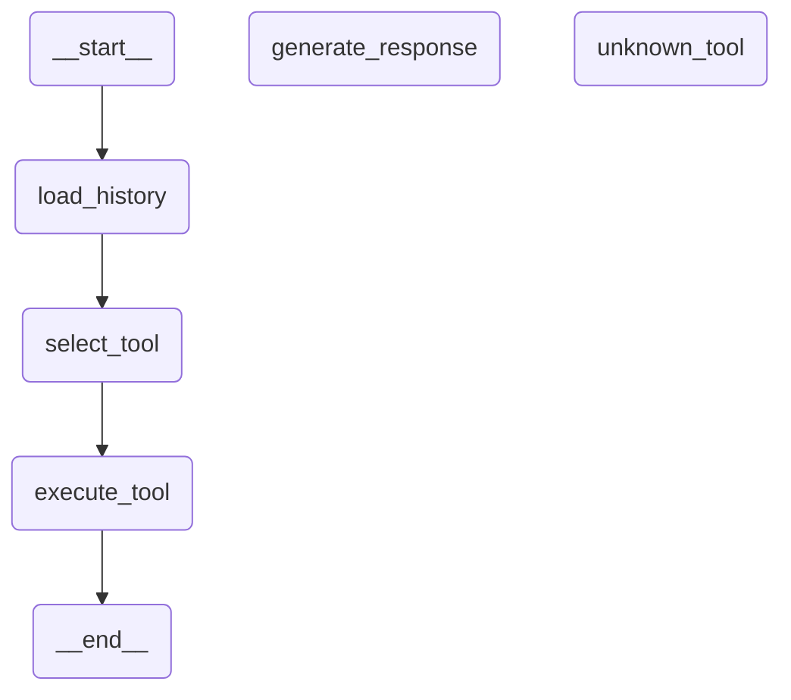

# Agent Graph

```mermaid
---
config:
  flowchart:
    curve: linear
---
graph TD;
	__start__(<p>__start__</p>)
	load_history(load_history)
	select_tool(select_tool)
	execute_tool(execute_tool)
	generate_response(generate_response)
	unknown_tool(unknown_tool)
	__end__(<p>__end__</p>)
	__start__ --> load_history;
	load_history --> select_tool;
	select_tool --> execute_tool;
	execute_tool --> __end__;
	classDef default fill:#f2f0ff,line-height:1.2
	classDef first fill-opacity:0
	classDef last fill:#bfb6fc

```