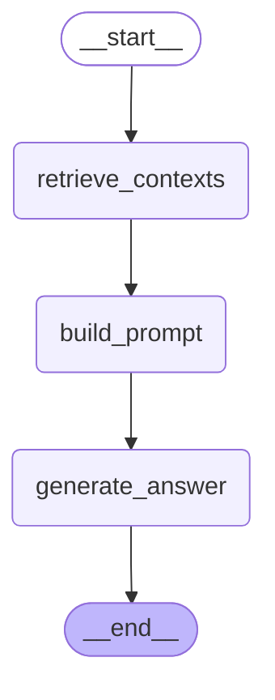

# RAG Graph

```mermaid
---
config:
  flowchart:
    curve: linear
---
graph TD;
	__start__([<p>__start__</p>]):::first
	retrieve_contexts(retrieve_contexts)
	build_prompt(build_prompt)
	generate_answer(generate_answer)
	__end__([<p>__end__</p>]):::last
	__start__ --> retrieve_contexts;
	build_prompt --> generate_answer;
	retrieve_contexts --> build_prompt;
	generate_answer --> __end__;
	classDef default fill:#f2f0ff,line-height:1.2
	classDef first fill-opacity:0
	classDef last fill:#bfb6fc

```